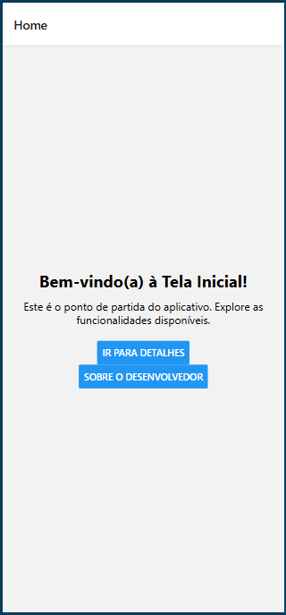
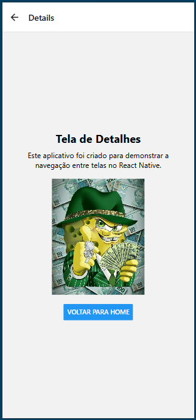
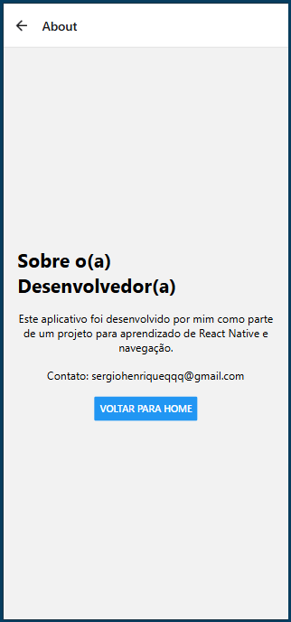

# 🧭 React Native Navigation App

Este é um projeto simples em **React Native** utilizando o **Expo** para demonstrar **navegação entre telas** com `@react-navigation/native` e `@react-navigation/native-stack`.

## 📱 Telas do Aplicativo

- **Home**: Tela inicial com botões para navegar.
- **Details**: Tela de detalhes com uma imagem ilustrativa.
- **About**: Tela sobre o desenvolvedor com informações de contato.

---

## 🚀 Tecnologias Utilizadas

- [React Native](https://reactnative.dev/)
- [Expo](https://expo.dev/)
- [React Navigation](https://reactnavigation.org/)
- [React Native Stack Navigator](https://reactnavigation.org/docs/native-stack-navigator)

---

## 📂 Estrutura de Pastas

```
📁 screens/
│   ├── HomeScreen.js
│   ├── DetailsScreen.js
│   └── AboutScreen.js
📄 App.js
📄 index.js
📄 package.json
```

---

## ▶️ Como executar o projeto

1. **Clone o repositório:**
```bash
git clone https://github.com/seu-usuario/nav-app
cd nav-app
```

2. **Instale as dependências:**
```bash
npm install
```

3. **Inicie o projeto com o Expo:**
```bash
npm start
```

Ou use:

- `npm run android` – para rodar em um emulador Android
- `npm run ios` – para rodar no iOS (macOS)
- `npm run web` – para rodar no navegador

---

## 🧠 Objetivo

Este projeto foi criado com o intuito de praticar conceitos básicos de **navegação entre telas** no React Native, utilizando **Stack Navigator**.

---

## 👤 Desenvolvedor

**Sérgio Reis**  
📧 sergiohenriqueqqq@gmail.com

---

## 🖼️ Capturas de Tela







---

## 📜 Licença

Este projeto é apenas para fins educacionais.
